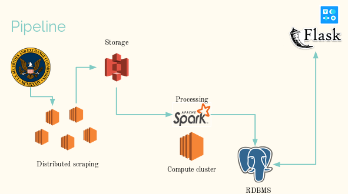
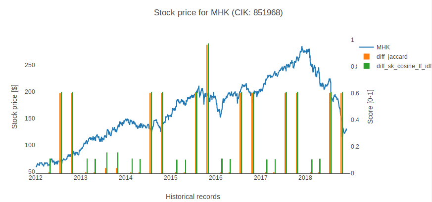
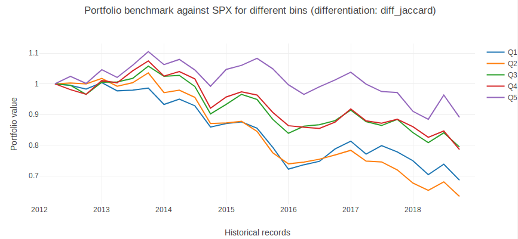

# Lazy prices: An NLP study of the changes in 10-K/10-Q

1. [Motivation](#motivation)
2. [Pipeline](#pipeline)
3. [Dataset](#dataset)
4. [Conversion](#conversion)
5. [Transformation](#transformation)
6. [Database](#database)
7. [Visualization](#visualization)
8. [Notes](#notes)

## Motivation

In this project, I built a platform that parses public companies quarterly filings, that I will refer to as 10-Xs, and looks at similarities between them with various NLP metrics.

Furthermore, I formulate the hypothesis that **“No news, good news”**: companies that do not edit their filings from quarter to quarter outperform the market, while the ones that do see their stock value go down, as they were legally constrained to disclose bad news.

### Useful links

**Documentation** [Read The Docs!](https://sec-scrapper.readthedocs.io/en/latest/)

**Tests** [Tests](https://github.com/AlexBdx/secScraper/tree/master/tests)**

**Loosely based on** Cohen, Lauren and Malloy, Christopher J. and Nguyen, Quoc, Lazy Prices (March 7, 2019). 2019 Academic Research Colloquium for Financial Planning and Related Disciplines, [https://ssrn.com/abstract=1658471](https://ssrn.com/abstract=1658471)

## Pipeline

The pipeline can be described by the following picture:

## Dataset
A few datasets are used in this project:

|Name of the dataset|Number of txt files|Total size (Gb)|
|---|---|---|
|SEC scraping|~1,000,000|2,500|
|Filtered scraping|~1,000,000|125|
|Stock prices|1|1|
|Lookup CIK/Tickers|1|0|
|Market index|4|0|

The available data spans 1997 Q1 - 2018 Q4.

## Conversion
Once the raw data has been scraped from the SEC's website, we are left with a collection of html files. These need to be parsed and filtered in order to remove all the html tags, the embedded pictures & zip and the financial data. Beautiful Soup is used for that purpose, yielding 125 Gb of filtered data.

## Transformation

The filtered data is processed using Spark. This involves parsing the reports, finding the sections in the unorganized text with multiple layers of regex and comparing them using various metrics.

Two main challenges arose:
1. Even after many iterations aimed at improving the parser, only 80-85% of the reports are successfuly parsed. Among them, less than 2% of the the reports are false positive.
2. Depending the metric, the RAM requirements vary from limited to high, even leading to swapping which slows down the compute node to a crawl. The type of instance was upgraded to m5.2xlarge and a function was added to check the amount of RAM before using these resource intensive metrics.

## Database

The results are stored in PostGres. The user interacts with the system via a Dash/Flask powered web app, available at:

[sec-scraper.club](sec-scraper.club) (Copy paste in browser if not re-directed)

WARNING: I generated the SSL keys myself, and nothing was certified by a third party so your browser might flag the connection as suspicious. But I just did not pay for a pro service here.

## Visualization

The user interacts with the system via a web app. Two views are possible:
1. The company view
2. The portfolio view

### Company view
The company view shows the result of the metrics for a given ticker. Ideally, a correlation can be observed between quarter with high similarities scores and soaring stock price. Likewise, a negative correlation would be observed between low similarity scores and falling stock price.

However, the metrics seem to change a lot in the above picture. Why? Because there are two ways to compare reports:
1. Quarterly comparisons, which means that twice a year a 10-K/10-Q comparison happens (that's what happens in the above picture).
2. Yearly comparisons, which means that a 10-K is always compared to a 10-K & the same for 10-Qs.

### Portfolio view
In the portfolio view, the company have been grouped by quintiles of similarity scores. Q1 is the portfolio of companies with the lowest similarity scores for a given metric, and Q5 the portfolio of companies with the highest similarity scores. Stocks are kept in the portfolio for one quarter, then all of them are sold, a tax is applied, and the new portfolio is purchased. 

Ideally, the portfolio are layered: Q5>Q4>Q3>Q2>Q1, which is most of the time the case. Even better, we would like to see Q5 to beat the main market indices.

## Notes
### What is EDGAR (from the SEC's website)?
[EDGAR](https://www.sec.gov/edgar/searchedgar/companysearch.html) is the Electronic Data Gathering, Analysis, and Retrieval system used at the U.S. Securities and Exchange Commission (SEC). EDGAR is the primary system for submissions by companies and others who are required by law to file information with the SEC. 

Containing millions of company and individual filings, EDGAR benefits investors, corporations, and the U.S. economy overall by increasing the efficiency, transparency, and fairness of the securities markets. The system processes about 3,000 filings per day, serves up 3,000 terabytes of data to the public annually, and accommodates 40,000 new filers per year on average.
